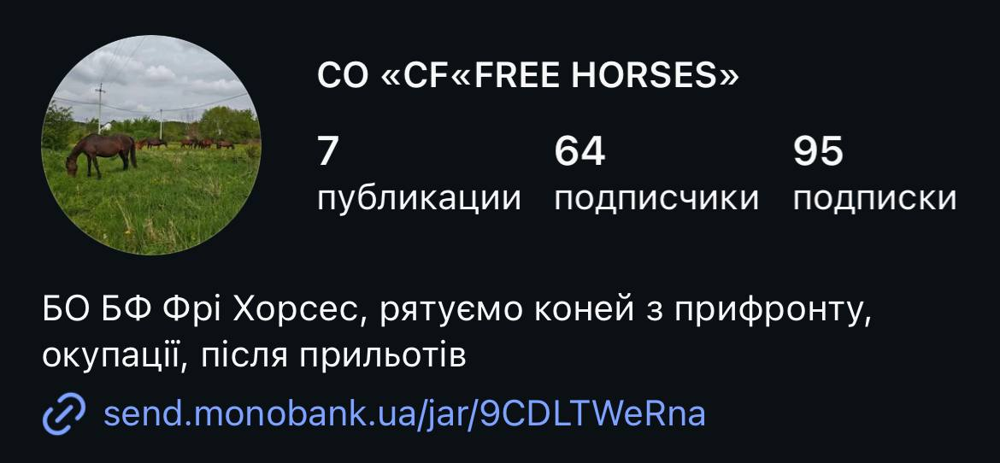

# 🐴 Charity Growth Project

> An end-to-end growth and digital development project for a charity foundation dedicated to rescuing and caring for horses.

<b>The overall goal</b> is to help the foundation build a stronger and more sustainable digital presence and explore ways to increase awareness, engagement, and donations.

The project combines data analytics, social media strategy, marketing, experimentation, web development, and AI-powered tools to explore how a small charity can strengthen its digital presence, reach more people, and ultimately increase its ability to receive support.

 

## 🐎 About the Foundation

<b>Free Horses is a Ukrainian foundation that rescues horses and provides them with ongoing care, feeding, and rehabilitation.</b>

Its work is largely supported by voluntary contributions and donations. Caring for rescued horses requires significant and continuous financial resources, including expenses such as food, veterinary care, transportation, and everyday maintenance.

One of the current challenges is therefore not only the direct cost of caring for the animals, but also reaching enough people who are willing and able to support the foundation.

 

## 🔎 Current Situation (Status as of August 23, 2026)

At the moment, the foundation's <b>only official online presence is its Instagram account:</b>

There is currently no dedicated website or other centralized online platform providing comprehensive information about the foundation, its mission, rescued horses, ongoing activities, fundraising campaigns, or ways to support its work. As a result, <b>Instagram currently serves as the foundation's primary — and effectively only — public-facing digital channel.</b>

 

Based on my experience volunteering with the foundation, <b>I identified a potential problem: the lack of a dedicated website may make it more difficult for new audiences to understand the organization and develop trust in it.</b> My initial hypothesis was:

> A dedicated website could help the foundation establish a more credible, transparent, and trustworthy online presence, making it easier for potential supporters to understand the organization and decide whether they want to support it.

 

To evaluate the initial hypothesis, I reviewed research examining how people use social media and organizational websites when deciding whether to donate to charitable organizations. 

The authors of an article <i><a href="https://onlinelibrary.wiley.com/doi/10.1002/nvsm.70046"> Digital Users Perceptions of Philanthropic Donations Across Social Media and Institutional Websites, Journal of Philanthropy, 2026 </a></i> surveyed 585 people who had made donations after seeing posts by charitable organizations on social media and reached some interesting conclusions: 
- <b>78% of respondents visited the organization’s website before making a donation.</b>
- Only 22% donated immediately after viewing a social media post, without further researching the organization (people were motivated by trust formed by perceptions of institutional credibility, transparency, empathy, and religious values)

People use charity websites to verify the organization’s credibility, legal status, program information, and transparency regarding the use of funds. Based on this, <b>the authors recommend linking social media engagement to the website to build trust among potential donors.</b>

So, this article has confirmed the importance of creating a website - let's get to work. 

 

# Nonprofit Website: Research-Based Design Principles

Now that we know a website is needed, let's look at **how the website should look and what it should contain**.

 

#### 1. Emotional & Cognitive Information

The study [*How website information decreases intangibility and influences donation*](https://onlinelibrary.wiley.com/doi/10.1002/nvsm.1702) found that a well-designed website can reduce the perceived "intangibility" of a nonprofit organization and increase people's intention to donate. The study also found that less experienced donors tend to respond more strongly to **emotional cues**, while more experienced donors are more influenced by **cognitive information** - facts, figures, how the money is spent, and what results have been achieved. However, the study was conducted with students, so it should not be treated as universal evidence for the entire donor population. It is still a useful basis for forming a hypothesis.

Implication for our website
> The foundation's website should combine both **emotional** and **cognitive** information.
> - **Emotional content:** Real photos of the horses and foundation staff, Rescue stories, Videos, Personal stories and updates.
> - **Cognitive information:** Funding targets and amounts raised, Measurable results, Purchase and spending reports, Organization's location, Contact information, Information about how donations are used

 

#### 2. Aesthetics, Information Quality, and Trust

The study [*Investigating antecedents and their consequences of usability in online donations: the case of university students' community services programs*](https://www.inderscience.com/info/e_filter.php?aid=92296) found that **aesthetics, information quality, and credibility** positively influence donors' trust, satisfaction, and loyalty toward nonprofit organizations.

Based on these findings, we can define several key criteria for the website design:
> - **Aesthetics:** A consistent visual identity, High-quality photography, Clean and readable typography, A professional but human visual style.
> - **Information Quality:** Specific and up-to-date information about the foundation, Clear information about the horses, Current fundraising campaigns, Concrete results and impact, Regular updates
> - **Trust:** Transparency, Clear contact information, Legal and organizational details, Financial reporting, Evidence of the foundation's activities
> - **Usability:** Information should be easy to find, Navigation should be simple and intuitive, Users should be able to quickly understand who we are, what we do, and how they can help
> - **Loyalty.** The website should also encourage continued engagement, such as: Subscribing to updates, Returning to the website, Making repeat donations, Following the foundation's ongoing work

 

#### 3. Visual Appeal and Human Imagery

Another study found that **visual appeal and images of people** increase perceptions of a nonprofit website's **benevolence and competence**. These perceptions, in turn, influence people's intention to use the website for donations.

Implication for our website
> Particular attention should therefore be paid to the quality and authenticity of the visual content. **No AI or Stock photos** - Only Real photos of the horses, farm, staff, volunteers etc.

 

#### 4. Transparency and Public Disclosure

The authors of [*An examination of web disclosure and organizational transparency*](https://www.researchgate.net/publication/228264225_An_Examination_of_Web_Disclosure_and_Organizational_Transparency) argue that organizations that voluntarily disclose high-quality **financial and operational information** on their publicly accessible websites are perceived by the public as more open and trustworthy.

Implication for our website
> Transparency should be an integral part of the website rather than something hidden in a footer or available only upon request. The website should provide access to: Financial reports, Information about how donations are spent, Fundraising goals and outcomes, Operational information, Organizational details, Contact information, Evidence of completed activities and projects

 

#### 5. The Ukrainian Nonprofit Context

It is also important to consider the specific context of the Ukrainian nonprofit sector. The study [*Toward Greater Legitimacy: Online Accountability Practices of Ukrainian Nonprofits*](https://www.researchgate.net/publication/264633222_Toward_Greater_Legitimacy_Online_Accountability_Practices_of_Ukrainian_Nonprofits) highlights several important characteristics of Ukrainian nonprofits:

- The level of information disclosure among nonprofits is relatively low.
- Nonprofits that do not provide their physical address tend to receive lower evaluations.
- Ukrainian understandings of civil society tend to emphasize informal action, shared values, accountability, and a sense of community rather than simply membership in formal organizations.
- Public trust in nonprofits in Ukraine is relatively low.
- Accountability practices influence public attitudes toward nonprofits and contribute to financial and ethical integrity.

Implication for our website
> For a Ukrainian nonprofit, transparency and accountability should be treated as **core elements of the website's design and content strategy**. Particular attention should be paid to publicly disclosing organizational information, including: Physical address, Contact information, Legal/organizational details, Financial reports, Information about fundraising, Information about how funds are used, Evidence of the foundation's activities

 

#### Key Takeaways

Based on the research reviewed above, the website should combine **emotional storytelling with concrete evidence**. The core principles are:

| Principle | What it means for the website |
|---|---|
| **Emotional connection** | Real horses, people, rescue stories, photos, and videos |
| **Information quality** | Clear, specific, and up-to-date information |
| **Visual appeal** | Consistent identity, high-quality photography, clean typography |
| **Trust** | Transparency, legal information, contacts, reports, and evidence |
| **Usability** | Simple navigation and easy access to important information |
| **Accountability** | Public financial and operational information |
| **Impact** | Clear evidence of what donations actually achieve |
| **Loyalty** | Opportunities to follow the foundation, return, and support it again |

The overall goal is to create a website that does more than **look professional**. It should make the foundation's work **visible, understandable, verifiable, and trustworthy**.

 

# Nonprofit Website: UX/UI design

